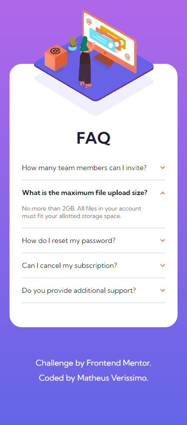

# Frontend Mentor - FAQ accordion card

Esta é uma solução para o [FAQ accordion card challenge on Frontend Mentor](https://www.frontendmentor.io/challenges/faq-accordion-card-XlyjD0Oam).

## Screenshots

## Links

Link: https://mveryy.github.io/FAQ-accordion-card/

## Aprendizados

Neste projeto eu pude aplicar e treinar meus conhecimentos em CSS e JavaScript.

## Construído com

-   HTML5
-   CSS3
-   JavaScript

## Autores

-   [@Mveryy](https://github.com/Mveryy)
